# Pokémon Polished Crystal — deutsche GSC-Kanon-Lokalisierung

Deutsche Lokalisierung von [Rangi42/polishedcrystal](https://github.com/Rangi42/polishedcrystal) **3.2.3**.  
Kein eigenes Spiel — nur der **Text-Layer** im Stil von **Pokémon Kristall (GSC-DE)**.

| | |
|---|---|
| **Status** | WIP — spielbar, Feedback erwünscht |
| **Basis** | Polished Crystal 3.2.3 · pret/pokecrystal |
| **Aktuell pure-DE** | **ROM 3.2.3.050** (Summary-Reiter DE) |
| **Upstream** | [Rangi42/polishedcrystal](https://github.com/Rangi42/polishedcrystal) |
| **Disassembly** | [pret/pokecrystal](https://github.com/pret/pokecrystal) |

> Mit **Grok 4.5** (xAI) unterstützt. Es können noch Fehler, Zeilenumbrüche oder einzelne EN-Stellen vorkommen.  
> **Feedback willkommen** (Issues / PRs).

---

## Inhaltsverzeichnis (Lokalisierung)

1. [Schnellstart](#schnellstart)
2. [Changelog (aktuell)](#changelog-aktuell)
3. [ROM-Übersicht 001–050](#rom-übersicht-001050)
4. [Was ist übersetzt?](#was-ist-übersetzt)
5. [Qualitätsregeln](#qualitätsregeln)
6. [Orden & Orte](#orden--orte)
7. [Tools & Docs](#tools--docs)
8. [Residuen](#residuen)
9. [Credits](#credits-lokalisierung)
10. *[Originalspiel-README (DE-Übersetzung)](#pokémon-polished-crystal)* — Features von Polished Crystal selbst

---

## Schnellstart

1. Repo klonen / bauen → siehe [`INSTALL.md`](INSTALL.md)  
2. Fertige **ROMs liegen nicht im Repo** (Copyright) — lokal mit `tools/save_rom_versioned.ps1` versionieren  
3. **Vollständige ROM-Historie:** [`docs/ROM_HISTORY.md`](docs/ROM_HISTORY.md)  
4. Frühphase 001–015: [`docs/ROM_HISTORY_001-015.md`](docs/ROM_HISTORY_001-015.md)

---

## Changelog (aktuell)

Neueste pure-DE-Builds zuerst. Ältere Nummern → [ROM-Übersicht](#rom-übersicht-001049) bzw. [`docs/ROM_HISTORY.md`](docs/ROM_HISTORY.md).

### 050 · 2026-07 — Summary-Reiter (PNG)

- Status-Screen-Tabs (OAM-Sprites): **EP · Fähig. · Item · Att. · Ort · Ei** (statt Exp./Ability/Move/Met/Egg)
- Fundort-Zeile: `Tag, Lv.15` statt `Tag bei Lv.15`

### 049 · 2026-07 — `#COM` / `#DEX`-Casing

- **PokéCOM** statt „PokéCom“ im Beutel/Pokégear-Menü (`#COM`)
- **`#DEX`** im Spezial-Item-Menü; Dialoge `#Com` → `#COM` (Center, Radio, …)

### 046–048 · Optionen & QWERTZ (v0.9-Textstand)

| ROM | Inhalt |
|---|---|
| **048** | **QWERTZ**-Tastatur (DE), Standard in Optionen |
| **047** | Optionen-Menüs / Perfect-DVs-Labels |
| **046** | Kampf-Stil / Optionen GSC-DE polish |

### 040–045 · Items, Dex, Scripts

| ROM | Inhalt |
|---|---|
| **045** | Kritische **Script-Stubs** 1:1 Upstream (Mr.#MON-Ei, Route 43, Sudowoodo, Spielhalle, Alph, Phone, Rocket, Buena, …) |
| **044** | Schwachstellen: `#MON`, Phone „Sorry“, `(TRAGEN)`, over18, EN-Kommentare |
| **043** | Dex **#001–#251** dump-soft; Aprikoko/Kurt; Optionals dokumentiert |
| **042** | Mail- & Key-Items dump-Finish (~139 Item-Descs) |
| **041** | Items erweitert (Steine, Beeren, King-Stein, Seide, …) |
| **040** | Items + Attacken dump-Basis; Fähigkeiten bleiben **C** |

### 027–039 · Phone, Namen, Feinschliff

| ROM | Inhalt |
|---|---|
| **035–039** | Trainer-/Speaker-Namen, CAPS, JOHTO/KANTO, over18-Feinschliff |
| **033–034** | Alle Phone-Rematch-Namen DE; Zwischenbuild |
| **030–032** | Phone-Anzeigenamen (REINHOLD, ALFONS, …); Buena-Passwörter; Radio / Duellturm |
| **027–029** | Optional-Scan, Phone/Buena/Shamouti, LOTTE |

### 019–026 · Johto → Kanto → Rest-Pass

| ROM | Inhalt |
|---|---|
| **026** | Rest-Pass: `#MON` global, Uni, **DUELLTURM**, Telefon, `common.asm` |
| **024–025** | Liga + Kanto (TOP VIER, Städte, Arenen, **FARBORDEN**, …) |
| **019–023** | Azalea→Ebenholz (Orden Insekt–Drache), Mid-Johto, Badge-QC |

### 001–018 · Fundament & Early-Game

| ROM | Inhalt |
|---|---|
| **016–018** | Viola Gramps / PKMN-ARENA; Route-32-Übergang; Azalea-Eingang |
| **012–015** | Neuborkia→Viola dump; Mama **Schatz**; **FLÜGELORDEN** |
| **009–011** | Softlocks: `sdefer`, `text_ram`, Deep-Scan, „verschlafen“ |
| **001–008** | DE-Start, 18-Zeichen-Reflow, `line`/`cont`, Proofreading, GSC-Canon-Marker |

---

## ROM-Übersicht 001–050

| Block | Thema |
|---|---|
| **001–008** | Fundament DE, Reflow, Proofreading |
| **009–011** | Softlocks & Script-Fixes |
| **012–018** | Early-Johto Dump (bis Azalea-Eingang) |
| **019–023** | Mid-Johto + Badge-QC |
| **024–026** | Liga, Kanto, Rest-Pass |
| **027–033** | Phone / Buena / Radio |
| **034–039** | Namen, CAPS, Feinschliff |
| **040–045** | Items, Moves, Dex, Script-Stubs |
| **046–048** | Optionen, QWERTZ / v0.9 |
| **049** | `#COM` / `#DEX`-Casing (PokéCOM) |
| **050** | Summary-Reiter DE (EP/Fähig./Att./Ort/Ei) |

Detail pro Nummer: [`docs/ROM_HISTORY.md`](docs/ROM_HISTORY.md)  
Zähler: `tools/_rom_build_version.txt` · nächster Build: **051**

---

## Was ist übersetzt?

| Bereich | Inhalt |
|---|---|
| **Karten / NPCs** | ~607 Map-Skripte (Dialoge, Schilder, Story) |
| **Telefon** | Caller, Overworld, Rematch-Namen |
| **System / Kampf** | `common.asm`, Kampftexte, findet/erhält, Whiteout, … |
| **UI** | Startmenü, Beutel, Optionen, Party, PC, Summary |
| **Daten** | Artnamen, Dex, Attacken, Fähigkeiten, Wesen, Items, Orden, Typen |
| **Orte** | GSC-DE-Glossar (NEUBORKIA, DUKATIA CITY, …) |
| **BT & Co.** | Duellturm / Kampffabrik UI & Trainertexte |

### Bewusst nicht 1:1 Kristall

- Polished-only-Inhalte (neue Orte, Features) → DE im **GSC-Stil**, kein Dump  
- Gen-3+ (Fähigkeiten, Wesen, phys./spez. Split) → offizielle DE-Begriffe  
- Grafik-Text in manchen Tiles/Logos kann EN bleiben  

---

## Qualitätsregeln

| Regel | Detail |
|---|---|
| **A / B / C** | **A** Dump 1:1 · **B** Dump + PC-Mechanik · **C** PC-only DE + CAPS |
| **Breite** | TEXTBOX **18**; `#MON` / `#BALL` / `#DEX` / `#COM` = 7; `<PLAYER>` = 7 |
| **`{d:NAME}`** | Wird beim Assemblieren ersetzt (feste Breite) |
| **Verboten** | `<PLAY_G>` · `;` in Strings · `@` mitten im String |
| **Formulierungen** | `findet` / `erhält` · `PKMN-ARENA von …` · CAPS-Orte |
| **Override** | Mama: **Schatz** (nicht Dump „Baby“) |

---

## Orden & Orte

### Johto (Dump → Kurzname UI)

| Orden | Kurz | Orden | Kurz |
|---|---|---|---|
| FLÜGELORDEN | Flügel | STAHLORDEN | Stahl |
| INSEKTORDEN | Insekt | FAUSTORDEN | Faust |
| BASISORDEN | Basis | EISORDEN | Gletscher *(UI)* |
| PHANTOMORDEN | Phantom | DRACHENORDEN | Drache |

### Kanto

| Orden | Kurz | Orden | Kurz |
|---|---|---|---|
| FELSORDEN | Fels | SEELEN-/SUMPFORDEN | Seele / Sumpf |
| QUELLORDEN | Quell | VULKANORDEN | Vulkan |
| DONNERORDEN | Donner | ERDORDEN | Erde |
| FARBORDEN | Farbe | | |

### Orte (Auswahl)

NEUBORKIA · ROSALIA · VIOLA · AZALEA · DUKATIA · TEAK · OLIVIANA · ANEMONIA · MAHAGONIA · EBENHOLZ · ALABASTIA · VERTANIA · MARMORIA · AZURIA · ORANIA · LAVANDIA · PRISMANIA · FUCHSANIA · SAFFRONIA · ZINNOBERINSEL · INDIGO PLATEAU · SILBERBERG · SEE DES ZORNS · KNOFENSA-TURM · M.S. AQUA · DUELLTURM

---

## Tools & Docs

| Datei / Ordner | Zweck |
|---|---|
| [`INSTALL.md`](INSTALL.md) | Bauen (DE) |
| [`docs/ROM_HISTORY.md`](docs/ROM_HISTORY.md) | ROM 001–049 Detail |
| `tools/save_rom_versioned.ps1` | Desktop-ROM `.001`, `.002`, … |
| `tools/_gsc_de_crystal_msg.txt` | GSC-DE-Dump-Referenz |
| `tools/gsc_canon_setup/` | Batch-Regeln & Scanner |

---

## Residuen

- Grafik-Text in manchen Tiles/Logos kann EN bleiben  
- PC-only-Ecken (z. B. Navel/Faraway-Jungle, Shamouti-Stubs) — Feinschliff nach Playtest  
- Stil, Breite, Kanon-Namen: Feedback erwünscht  

---

## Credits (Lokalisierung)

| | |
|---|---|
| **Spiel / Engine** | Rangi42 & Polished-Crystal-Mitwirkende |
| **Disassembly** | pret / pokecrystal |
| **DE GSC-Kanon-Lokalisierung** | Only1Rudeboy |
| **KI-Unterstützung** | Grok 4.5 (xAI) — WIP |

---

# Pokémon Polished Crystal

> **Übersetzungshinweis:** Der folgende Abschnitt ist die **deutsche Übersetzung** der originalen README von Polished Crystal (Rangi42). Er beschreibt das **Originalspiel** und seine Features — nicht die Lokalisierungsarbeit oben. Der englische Originaltext findet sich im Upstream-Repository.

Dies ist ein eigenes Pokémon-Spiel auf Basis der [Pokémon-Crystal-Disassembly](https://github.com/pret/pokecrystal).

Ziel ist genau das, was der Titel sagt: eine verbesserte, polierte Version von Pokémon Crystal. Es behebt Fehler, berücksichtigt offizielle Spieländerungen seit 2001 und bringt eigene Ideen ein. Viele Features stellen entfallene R/B/G-Inhalte wieder her oder stammen aus HG/SS.

Seit Jahren gab es vage Pläne für ein eigenes Pokémon-Spiel. Die Arbeit an der Crystal-Disassembly und die saubere Code-Organisation sind beeindruckend. Durch die Open-Source-Freigabe (und inspirierende ROM-Hacks) wird dieses Spiel endlich Realität.

> Es gibt viele Wege, Spiele zu machen, aber die Art, wie wir bei Game Freak arbeiten, unterscheidet sich vielleicht von anderen Firmen. Das heißt: Wir ändern und verfeinern ständig, was wir uns ausgedacht haben. Um ein spaßiges Spiel noch spaßiger und runder zu machen, nehmen wir das Vorhandene und denken es von vorn. Und um das Spiel möglichst unterhaltsam zu machen, ändern und justieren wir endlos, egal wie lange es dauert. Das mag nicht der beste Weg sein, aber ich halte diese Feinarbeit für wichtig, damit unsere Spiele spaßig und besser werden.
>
> — Junichi Masuda, „[HIDDEN POWER of masuda No. 7](https://www.gamefreak.co.jp/blog/dir_english/?p=21)“

## Herunterladen und spielen

Die **aktuelle offizielle Release-Version** des Originals ist **v3.2.3** (das „Polished Crystal“-Release). Sie ist von Anfang bis Ende spielbar und enthält große Überarbeitungen an Gameplay, Mechanik und Komfort. Ein ausführlicherer Changelog folgt noch; die wichtigsten Punkte stehen unten.

- **[v3.2.3 hier herunterladen (Original-Release)](https://github.com/Rangi42/polishedcrystal/releases/tag/v3.2.3)**

> **Zu diesem Fork:** Für die **deutsche Fassung** baust du idealerweise **aus diesem Repository** (oder nutzt eine selbst erstellte ROM). Offizielle Upstream-ROMs sind **englisch**.

Die vorherige offizielle Version war [v3.1.1](https://github.com/Rangi42/polishedcrystal/releases/tag/v3.1.1) (1. Februar 2025).

*Fragen zu Spiel oder Patchen? [Lies die FAQ](FAQ.md)!* (FAQ im Upstream ggf. noch auf Englisch.)

## Was ist neu in v3.2.3

Kurze Zusammenfassung der großen Änderungen und Ergänzungen. Ein detaillierter Changelog folgt.

- **Anpassbarer Neues-Spiel-Setup:** Wesen und Fähigkeiten ein/aus, EV-Regeln (klassisch unbegrenzt, modern 510, oder aus), plus weitere Optionen vor dem Start.
- **DVs bestimmen nicht mehr Wesen/Schillernd/Geschlecht/Icognito-Form:** DVs beeinflussen weiter leichte Farbvarianten derselben Art; alles andere läuft getrennt.
- **Überarbeitete Kampf-Engine und HUD:**
  - Fähigkeiten werden unterstützt.
  - Attacken verhalten sich näher an modernen Versionen.
  - Kleinere HUD-Verbesserungen machen Kämpfe flüssiger.
- **Neue Attacken-Animationen:** Viele Attacken haben aktualisierte Animationen.
- **Optimierte Engine und 60-fps-Overworld:** Starke Engine-Optimierung; die Overworld läuft mit 60 Bildern pro Sekunde.
- **Neues Lagersystem:** PC-Oberfläche näher an modernen Spielen — Boxen wechseln, Pokémon verschieben, Team verwalten mit weniger Speicher-Ärger.
- **HGSS-inspirierter Pokédex:** Basiswerte, Eigruppen und eine ausführlichere Fundort-Karte mit *allen* Erhaltsmethoden.
- **Besseres Overworld-Wetter:** Statt nur Abdunkeln siehst du echten Regen, Schnee oder Sandstürme in passenden Gebieten.
- **Neue Status-Übersicht:** Ersetzt den klassischen Statusbildschirm. Zeigt Wesen, Fähigkeiten, gesehen/gefangen und mehr.

## Features

Die volle Feature-Liste steht in [FEATURES.md](FEATURES.md). Auszüge:

- **289 Pokémon-Arten**, inklusive neuer Entwicklungen, plus **56 kosmetische Formen** (z. B. Karpador-Muster, Flug-/Surf-Pikachu, Arbok-Muster, Icognito-Formen) und **46 Varianten** (Alola, Galar, Hisui, …) — insgesamt **391 einzigartige Pokémon**.
- **73 neue Attacken** (72 bei Faithful-Builds), **75 TMs** und **31 Attacken-Lehrer**.
- Moderne Mechaniken: **Fee-Typ**, **physisch/speziell-Split**, **Wesen**, **Fähigkeiten** und mehr.
- **Unbegrenzte TMs** und Komfort wie **Laufschuhe** und dauerhaftes **Schutz**.
- **Neue/überarbeitete Karten:** teils aus R/B/G, teils aus HG/SS „devamped“, plus Originale.
- **Neue Charaktere** u. a. Lorelei und Agatha (R/B/G), Lyra und Team-Rocket-Führung (HG/SS).
- **Mehr Postgame:** Arenaleiter-Rematches, neues Event nach dem Kampf gegen Rot, und mehr.
- **Bessere Levelkurve** mit stetig steigender Herausforderung.
- **Musik und Grafik** aus neueren Generationen adaptiert.

## Diskussion

Fragen oder Kommentare? Schau auf eine dieser Seiten oder schreib dort. (Zuerst die [FAQ](FAQ.md) lesen!)

- [Discord](https://discord.gg/ZK5pqK8)
- [Skeetendo](https://hax.iimarckus.org/topic/6874/)
- [PokéCommunity](http://www.pokecommunity.com/showthread.php?t=373172)
- [Romhack.me](http://www.romhack.me/polishedcrystal/wall/)
- [/r/PokemonROMHacks](https://www.reddit.com/r/PokemonROMhacks/comments/51kbcn/pok%C3%A9mon_polished_crystal_200/)
- [Nuzlocke Forums](http://s7.zetaboards.com/Nuzlocke_Forum/topic/11003710/)
- [Pokémon Hackers Online](http://www.pokemonhackersonline.com/showthread.php?t=15811)

Zusätzliche Ressource:

- [PolishedDex](https://www.polisheddex.app/) — Online-Begleiter für Polished Crystal: durchsuchbarer Pokédex, Attacken, Items, Orte, Fähigkeiten, Events und Team-Builder. Enthält FAQ und Links zu den offiziellen ROM-Releases — praktisch zum Nachschlagen beim Spielen. *(Inhalte dort beziehen sich auf das Original und sind größtenteils auf Englisch.)*

## Screenshots

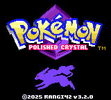
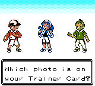
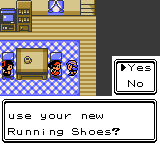
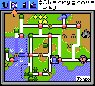

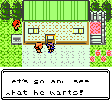
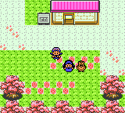
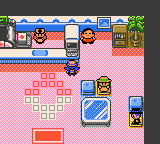
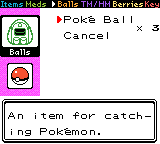

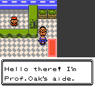
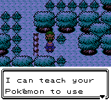
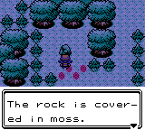
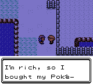

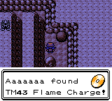
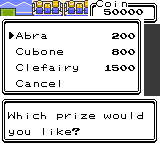
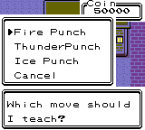
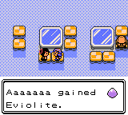

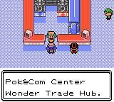
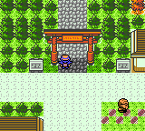
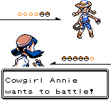
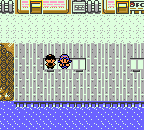

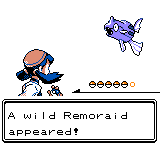
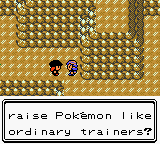
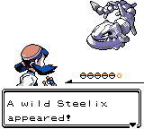
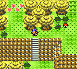

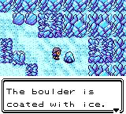
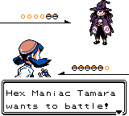
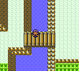
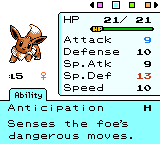

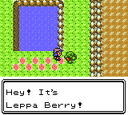
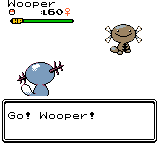
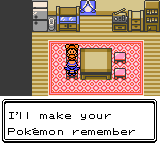
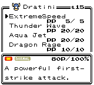

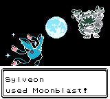
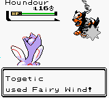
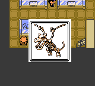
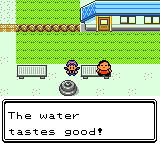

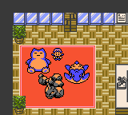
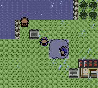
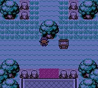
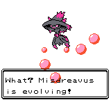

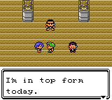
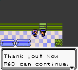
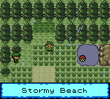
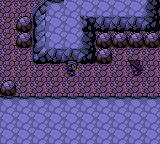

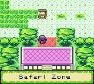
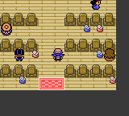
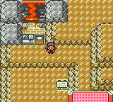
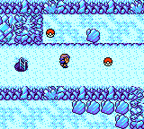
